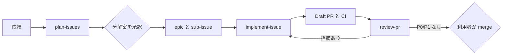

# agentic-dev-starter

coding agent（Codex / Claude Code）が **依頼を Issue に分解し，Issue ごとに branch，実装，Draft PR，レビューまで進める** ための
技術スタックに依存しないスターターです．利用者が判断するのは **分解案の承認** と **merge** の 2 か所だけです．

[ReoHakase/enterprise-agentic-saas-starter](https://github.com/ReoHakase/enterprise-agentic-saas-starter) の Issue と PR の運用を参考にし，
運用の部分だけを取り出して，Codex と Claude Code の両方で使えるようにしました．

## 流れ



| やりたいこと           | Claude Code           | Codex                 |
| ---------------------- | --------------------- | --------------------- |
| 依頼を Issue に分ける  | `/plan-issues`        | `$plan-issues`        |
| Issue #12 を実装する   | `/implement-issue 12` | `$implement-issue 12` |
| PR #34 をレビューする  | `/review-pr 34`       | `$review-pr 34`       |

例：

```text
/plan-issues 招待メールの再送機能を作りたい．期限切れの招待だけ再送できるようにしたい．
```

agent が分解案の表を示します．承認すると epic，sub-issue，依存関係（blocked by），label が GitHub に作られます．
その後 `/implement-issue <番号>` を依存の順に実行すると，Issue ごとに Draft PR ができます．

## 使い始める

1. GitHub で **Use this template** から自分のリポジトリを作り，clone する．
2. `gh auth login` 済みの状態で label を作る．

   ```bash
   bash scripts/setup-labels.sh
   ```

3. 技術スタックを決めたら，次を更新する．
   - `scripts/check.sh`：lint，型検査，テストを追加する．
   - `.github/workflows/ci.yml`：runtime の setup を追加する．
   - `docs/testing-strategy.md`：テスト層ごとの command と配置を書く．
   - `AGENTS.md`：source の境界など，プロジェクト固有の規則を追加する．
4. `main` に branch protection を設定し，`check` と `pr-policy` を必須にすることを推奨する．

必要なもの：`git`，`gh`（GitHub CLI），`bash`（Windows では Git Bash）．

## 構成

```text
AGENTS.md                      全 agent 共通の契約（Codex はこれを直接読む）
CLAUDE.md                      @AGENTS.md を読み込み，Claude Code 固有の内容を足す
.agents/skills/                skill の正本（plan-issues，implement-issue，review-pr）
.claude/skills/                .agents/skills のコピー（scripts/sync-skills.sh で生成，手編集しない）
.claude/agents/reviewer.md     Claude Code の read-only レビュー担当 subagent
.claude/settings.json          merge，Draft 解除，force push などを deny
.codex/config.toml             Codex の sandbox 設定
.github/ISSUE_TEMPLATE/        作業，不具合，epic の Issue Forms
.github/pull_request_template.md
.github/workflows/ci.yml       check（必須検査），pr-policy（Closes が 1 件か）
docs/                          作業の流れ，Issue と PR の書き方，レビューの観点，テスト方針，ADR，exec plan
scripts/                       check.sh，sync-skills.sh，setup-labels.sh
```

## Issue と PR の書き方の要点

詳細は [docs/architecture/issue-pr-authoring.md](docs/architecture/issue-pr-authoring.md) にあります．

- **1 Issue = 1 PR = 1 レビュー単位**．`size:L` は実装せず sub-issue に分ける．
- **Issue は予定，PR は結果**．振る舞いは Given-When-Then で書く．
- **PR は上から読める順序にする**．概要と `Closes` の次に「レビューの入口」（読む順序と重点）を置く．
- **確認結果は 1 つの表にまとめる**．✅ 成功，❌ 失敗，⏭ 未実施（理由）．現在の head で実際に実行した結果だけを書く．
- **親子関係，依存，担当は GitHub の機能で管理する**．本文に複製しない．

## skill を編集するとき

`.agents/skills/` を編集してから同期します．CI は `.claude/skills/` とのずれを検出します．

```bash
bash scripts/sync-skills.sh
```

## License

MIT
