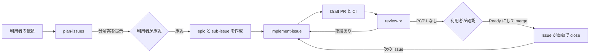

<!-- Derived from docs/architecture/coding-agent-workflow.md in Enterprise Agentic SaaS Starter (https://github.com/ReoHakase/enterprise-agentic-saas-starter), Copyright 2026 Reo Hakuta, Apache-2.0. Modified by aururn: translated, restructured, and changed. -->

# coding agent の作業の流れ

## 目的

利用者の依頼を Issue に分解し，Issue ごとに branch，実装，Draft PR，レビューまでを coding agent が進める．
利用者は **計画の承認** と **merge** の 2 か所だけで判断する．
Codex と Claude Code のどちらでも同じ手順で動くよう，契約は `AGENTS.md`，手順は `.agents/skills/` に置く．

## 全体の流れ

| 段階 | skill             | 入力                   | 出力                                         | 利用者の判断 |
| ---- | ----------------- | ---------------------- | -------------------------------------------- | ------------ |
| 1    | `plan-issues`     | 依頼文                 | 分解案 → epic，sub-issue，blocked by，label  | 分解案の承認 |
| 2    | `implement-issue` | Issue 番号             | linked branch，commit，Draft PR，CI 結果     | なし         |
| 3    | `review-pr`       | PR 番号                | 指摘の一覧，修正 commit，更新した PR 本文    | なし         |
| 4    | なし              | Draft PR               | merge                                        | Ready と merge |

## client ごとの配置

| 役割             | 正本                         | Codex                        | Claude Code                                  |
| ---------------- | ---------------------------- | ---------------------------- | -------------------------------------------- |
| 共通の契約       | `AGENTS.md`                  | 直接読む                     | `CLAUDE.md` が `@AGENTS.md` で読み込む       |
| skill            | `.agents/skills/<name>/`     | 直接読む（`$<name>` で起動） | `.claude/skills/` のコピーを読む（`/<name>`） |
| 独立レビュー     | `docs/architecture/review-checklist.md` | 別 session または `/review` | `reviewer` subagent                          |
| 危険な操作の抑止 | `AGENTS.md` の禁止事項       | sandbox と approval 設定     | `.claude/settings.json` の `deny`            |

`.claude/skills/` は `bash scripts/sync-skills.sh` で生成し，clone 直後から使えるように Git で管理する．
CI の `skills-sync` job が `.agents/skills/` との差分がないことを検査する．

## branch と commit

- branch は `gh issue develop <番号> --name <番号>-<slug> --checkout` で作り，Issue と linked branch として関連付ける．
  `<slug>` は英小文字と `-` だけで，内容が分かる 2〜5 語にする（例：`12-resend-invitation`）．
- base は原則 `main` とする．依存する Issue の PR が未 merge の場合は実装を始めず，利用者に報告する．
- commit は Conventional Commits に従い，1 commit 1 関心事にする．

## GitHub の機能の使い方

| 情報             | GitHub の機能                                                    |
| ---------------- | ---------------------------------------------------------------- |
| 親子関係         | sub-issue（`POST /repos/{owner}/{repo}/issues/{n}/sub_issues`）  |
| 依存             | blocked by（`POST /repos/{owner}/{repo}/issues/{n}/dependencies/blocked_by`） |
| 種別，サイズ，状態 | label（`scripts/setup-labels.sh` で作成する）                   |
| Issue と branch  | linked branch（`gh issue develop`）                              |
| Issue と PR      | PR 本文の `Closes #<番号>`                                       |

どちらの API も issue の `number` ではなく内部の `id`（`gh api repos/{owner}/{repo}/issues/{n} --jq .id`）を渡す．
API が使えない場合は，本文の「参照」に `親：#N`，`依存：#N` と書いて代替し，その旨を利用者へ報告する．

## 状態 label

| label                | 意味                                  | 付ける人・skill              |
| -------------------- | ------------------------------------- | ---------------------------- |
| `status:ready`       | Definition of Ready を満たす          | `plan-issues`                |
| `status:in-progress` | agent または人が実装中                | `implement-issue` の開始時   |
| `status:blocked`     | 依存または確認待ちで止まっている      | 止まった時点の skill         |

PR が merge されて Issue が close されたら，状態 label は外さなくてよい．

## 安全境界

- 利用者の明示の承認なしに，PR の Draft 解除，レビュー依頼，merge，本番配備，外部サービスの破壊的変更，
  有料の検査，force push を行わない．
- 別の担当者，別の実装，未解決の依存，想定外の remote の更新があれば，上書きせずに停止して報告する．
- 失敗した必須検査，P0/P1 の指摘を残したまま完了と報告しない．

## exec plan を作る場合

次のいずれかに当たる場合は，`docs/exec-plans/active/` に plan を作り，作業中に進捗と判断を更新する．

- epic を複数の session にまたがって進める．
- 途中で方針を判断した記録を，後の Issue でも参照する必要がある．

1 つの Issue で完結する作業では plan を作らず，Issue と PR を記録の正本にする．
