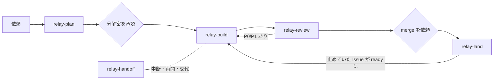

# Relay の設計

## 解きたい問題

coding agent に Issue 単位で作業を任せると，次のことが起きる．

1. **状態が会話の中に閉じる．** session が終わる，または別の agent に替わると，どこまで進んだかが分からない．
2. **repository ごとに運用が違う．** base branch，branch 名，PR title，検査の command が違うので，1 つの手順書を
   そのまま使い回せない．
3. **「確かめた」が信用できない．** 古い commit の結果や，実行していない検査が成功として報告される．
4. **大きな依頼がそのまま大きな PR になる．** レビューできず，切り戻しも難しい．

## Relay の答え

| 問題 | 仕組み | どこにあるか |
| --- | --- | --- |
| 1 | Issue ごとに 1 つのバトン comment を上書きし，状態と次の一手を置く | [baton.md](../skills/relay-core/references/baton.md) |
| 2 | repository ごとの値を `.agents/relay.yml` に集め，skill の本文には書かない | [profile.md](../skills/relay-core/references/profile.md) |
| 3 | PR に「確認した head」を書かせ，CI で今の head と照合する | [relay-pr-policy.mjs](../skills/relay-adopt/assets/github/scripts/relay-pr-policy.mjs) |
| 4 | 大きさ L を実装させず，分解案を人が承認してから Issue を作る | [relay-plan](../skills/relay-plan/SKILL.md) |

加えて，次の点で agent の作業を人が追いやすくする．

- **振る舞いは例の表で書く．** 状況，入力，期待する結果を 1 行ずつ並べる．文章の条件より境界と例外が見やすく，
  そのまま test の case になる．
- **PR は 5 節だけにする．** 変わること，見てほしいところ，Issue からの変更，確かめたこと，戻し方．
  レビューする人は「見てほしいところ」から読み始められる．
- **独立レビューは GitHub 上で受ける．** PR に `@codex review` と comment し，Codex の GitHub 連携のレビューを受ける．
  使えない場合は手元の別の agent でレビューし，結果を PR に comment する．指摘と対応が PR に残るので，
  利用者は PR を見るだけで経過が分かる．
- **merge の後まで面倒を見る．** Issue が閉じたかの確認，止めていた Issue の解除，stack の付け替え，worktree の片付け．

## 段階と承認

人が判断するのは，**分解案の承認** と **merge の依頼** の 2 か所だけである．それ以外の可逆な操作
（branch，commit，push，Draft PR，label，バトン）は，Issue 単位の依頼に含まれるものとして agent が進める．

## 配り方

skill は [`skills`](https://github.com/vercel-labs/skills) CLI で配る．導入先では Codex 用の `.agents/skills/` と Claude Code 用の
`.claude/skills/` に同じ skill が入り，`skills-lock.json` で取得元と版が記録される．
repository に固有の file（`relay.yml`，template，CI）は `relay-adopt` が置く．skill 自体には repository 固有の値を入れない．

## 判断の記録

[decisions/](decisions/README.md) にある．
